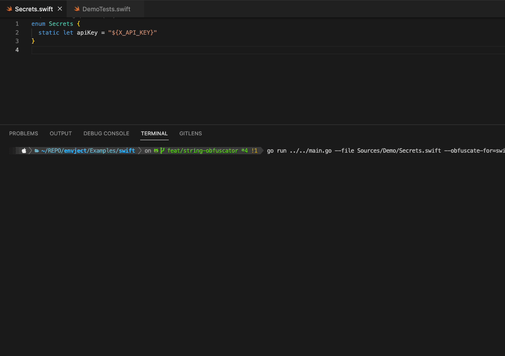

# 💉envject

[](https://codecov.io/gh/michaelhenry/envject)

A command-line tool for injecting environment variables or secrets to any file that has to be compiled especially in iOS.

I have written a [short article](https://www.iamkel.net/posts/6-ios-secrets-handling) regarding this.

And this is inspired by the functionality of [variable-injector](https://github.com/LucianoPAlmeida/variable-injector) but written in go and not dependent with the swift toolchain version.

## Demo


> This can allow us to prevent hard-coding production keys inside the project. So inside the CI, this can be executed during pre-compilation. And then after that, you can then do the obfuscation to guarantee that no strings are readable.

## The Problem with default Xcode's configuration (`.xcconfig`)

Using an `xcconfig` file in Xcode to store sensitive information and then accessing that information from the `Info.plist` file can have some potential downsides:

**Security risks**: Storing sensitive information in an xcconfig file can be a security risk. If you then use that information in the `Info.plist` file, it could be easier for an attacker to find and exploit that information.

**Complexity**: Accessing sensitive information through an xcconfig file and the `Info.plist` file can add complexity to your project, making it more difficult to manage and maintain.

**Increased chance of errors**: Using multiple files to manage your project's configuration settings increases the chance of errors, such as misconfigured settings or missing information.

**Version control conflicts**: If multiple developers are working on the project and are using different xcconfig files or Info.plist files, it can create conflicts in version control systems like Git.

**Debugging**: Debugging issues related to `.xcconfig` files and `Info.plist` files can be challenging, particularly if there are issues related to sensitive information.

## Installation/How to use

#### Use from source (must have a `go` installed on your machine)

```shell
git clone https://github.com/michaelhenry/envject/
cd envject

go run main.go --file sample.config.txt --debug true
```

#### Download the binary file from the release assets page.

- https://github.com/michaelhenry/envject/releases

```shell
./envject --file sample.config.txt
```

#### Using Homebrew (Recommended)

```shell
brew tap michaelhenry/envject
brew install envject
```

```shell
envject --file sample.config.txt
```

To avoid brew from updating which usually taking some time:

```
export HOMEBREW_NO_AUTO_UPDATE=1
```


## String obfuscation

**envject** is also supporting string obfuscation using the `obfuscate-for` flag.

For example:

### On Swift project

```bash
envject --file Sources/Demo/Secrets.swift --obfuscate-for swift
```


## LICENSE

MIT


## Other reference

- [Secret Management on iOS](https://nshipster.com/secrets/)